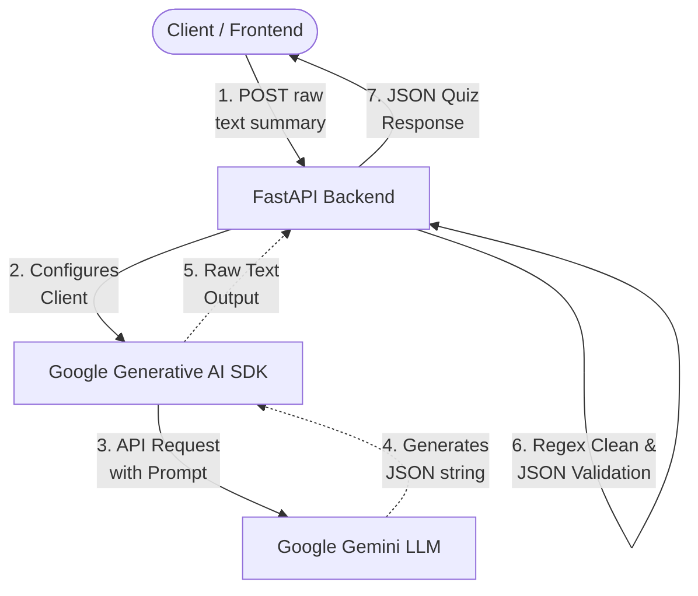
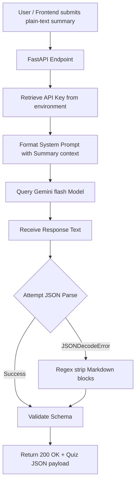

# 🧠 Shulker RAG : AI Quiz Generator API
A lightweight, production-ready FastAPI backend that transforms meeting summaries into structured multiple-choice quizzes using Google Gemini AI. Designed as a microservice to plug into the Shulker meeting ecosystem.

*Built for Shulker (AI Video Conferencing Assistant) - A focused microservice extension of the [Shulker_AI](https://github.com/Shulker-000/Shulker_AI) repository.*

💡 **Made by [Vasu Goel](https://github.com/vasug27)**

---


## ✅ Overview & Key Features

Shulker RAG is a stateless **AI-powered quiz generation microservice** designed to extract key meeting insights and convert them into interactive comprehension checks for team members.

### 🌟 Core Features
- **⚡ Asynchronous FastAPI Backend:** Engineered with FastAPI and Uvicorn for asynchronous execution and low overhead.
- **🧠 Automated MCQ Generation:** Instantly creates exactly **5 multiple-choice questions** with 4 distinct options and a correct answer mapping based on any meeting summary.
- **🔮 Gemini LLM Powered:** Leverages the state-of-the-art Google Gemini (`gemini-flash-latest`) for precise text understanding and generation.
- **🛡️ Raw Text Ingestion:** Parses raw plain text summaries directly from incoming network payloads without complex wrapper formats.
- **🎨 Structured JSON Responses:** Ensures standard, validated JSON schema output ready for seamless frontend integration.
- **🌐 CORS Enabled:** Configured to integrate cleanly with your frontend workspace out-of-the-box.

---

## 🛠️ Architecture Design



---

## 🛠 Tech Stack

| Category         | Technologies Used |
|------------------|--------------------|
| Backend Server   | FastAPI, Uvicorn |
| AI Model         | Google Gemini (`gemini-flash-latest`) |
| AI SDK           | google-generativeai 0.8.3 |
| Production Server | Uvicorn ASGI Server |
| Environment      | python-dotenv 1.0.1 |

---

## 🧠 Key System Components

*   **FastAPI Backend Server:** Handles client requests, performs payload validation, manages CORS headers, and routes backend responses.
*   **Google Gemini SDK (`google-generativeai`):** Connects to Google's Developer API endpoints and coordinates prompt transmission and raw response retrieval.
*   **Uvicorn ASGI Server:** Powers the high-concurrency local web server and handles asynchronous thread pooling.

---

## 📁 Folder Structure

```
Shulker_RAG/
├── api.py              # FastAPI app - routes, CORS, and Gemini quiz generation logic
├── requirements.txt    # Python backend dependencies
├── .env                # API key credentials (ignored by git)
├── .gitignore          # Excludes environments, credentials, and caches
└── README.md           # Project documentation
```

---

## ⚙️ Setup & Credentials Guide

Follow these steps to set up the service locally:

### 1️⃣ Google AI Studio (Gemini Key)
1. Go to [Google AI Studio](https://aistudio.google.com/).
2. Click **Create API Key** and copy the generated key.
3. Save it to a local `.env` file in the root folder:
   ```env
   GEMINI_API_KEY=your_gemini_api_key_here
   ```

### 2️⃣ Run Services Locally
```bash
# Clone and enter the directory
git clone https://github.com/vasug27/Shulker_RAG.git
cd Shulker_RAG

# Setup virtual environment
python -m venv myenv

# Activate virtual environment
# On macOS/Linux:
source myenv/bin/activate
# On Windows (Powershell):
myenv\Scripts\activate

# Install requirements
pip install -r requirements.txt

# Start the FastAPI Server
python api.py
```
The server will boot and listen at `http://localhost:5050` (or your custom port configuration).

---

## 🚀 Usage Guide / How to Use

1. **Start the API:** Ensure your local FastAPI server is running with a valid `GEMINI_API_KEY` set.
2. **Access Swagger UI:** Navigate to `http://localhost:5050/docs` in your browser.
3. **Execute Quiz Generation:** 
   - Click on the `POST /generate-quiz` endpoint.
   - Click **Try it out**.
   - Input the raw text summary in the request body text area.
   - Hit **Execute** to generate your multiple-choice questions.

---

## 🔐 Environment Variables (`.env`)

| Key              | Description                            |
|------------------|----------------------------------------|
| `GEMINI_API_KEY` | Google AI Studio Gemini API access key |

---

## 📊 Quiz Generation Flow



---

## 🗄️ Database & State Design

To ensure optimal response times, horizontal scaling simplicity, and microservice isolation, **Shulker RAG is designed completely stateless**:
- **No Database Needed:** The application does not store chat history, session state, or user accounts. All state is held in memory during the request lifecycle.
- **Direct Transformation:** It functions purely as a transaction processing pipe: `Summary Text ➡️ Interactive Quiz`.
- **Scaling Friendly:** Because it does not maintain persistent database connections or storage locks, the service can be easily containerized and spun up across auto-scaled environments (e.g., Render, Docker, AWS ECS) without overhead.

### 📋 Output JSON Schema
Since the application is stateless and doesn't use a traditional database schema, the data contract between this microservice and your frontend is defined by the following **JSON Schema** for the generated quiz:

```json
{
  "$schema": "http://json-schema.org/draft-07/schema#",
  "title": "QuizResponse",
  "type": "object",
  "properties": {
    "questions": {
      "type": "array",
      "items": {
        "type": "object",
        "properties": {
          "question": {
            "type": "string",
            "description": "The multiple-choice poll question text."
          },
          "options": {
            "type": "array",
            "items": {
              "type": "string"
            },
            "minItems": 4,
            "maxItems": 4,
            "description": "Four distinct multiple-choice options."
          },
          "answer_text": {
            "type": "string",
            "description": "The exact string value matching the correct answer option."
          }
        },
        "required": ["question", "options", "answer_text"]
      }
    },
    "count": {
      "type": "integer",
      "minimum": 0,
      "description": "The total number of quiz questions generated (exactly 5)."
    }
  },
  "required": ["questions", "count"]
}
```

---

## 📌 Backend API Routes

### 📌 API Overview

| Method | Endpoint | Description |
|--------|----------|-------------|
| GET | `/` | Health check - returns status summary |
| POST | `/generate-quiz` | Transduces plain-text summaries into formatted MCQ arrays |

---

### 📥 Route Details

#### `GET /`
- **Description:** Basic service health status checks.
- **Response Format (`application/json`):**
  ```json
  {
    "message": "Quiz Generator API is running.",
    "endpoint": "/generate-quiz",
    "input_format": "Raw text (summary)"
  }
  ```

#### `POST /generate-quiz`
- **Content-Type:** `text/plain`
- **Request Body (Raw Text):**
  ```text
  Theis repository is created by Vasu Goel.
  ```
- **Response Format (`application/json`):**
  ```json
  {
    "questions": [
      {
        "question": "Who created this repository?",
        "options": [
          "Vasu Goel",
          "Vansh Verma",
          "Aditya Goyal",
          "None of the above"
        ],
        "answer_text": "Vasu Goel"
      }
    ],
    "count": 1
  }
  ```

## 🧑 Author

**Vasu Goel**

[](mailto:vasugoel2754@gmail.com)
[](https://www.linkedin.com/in/vasugoel503/)
[](https://github.com/vasug27)